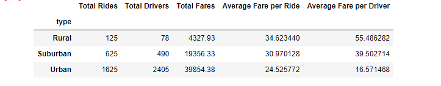

# PyBer_Analysis
## Overview of the analysis
The purpose of this project was to create visualizations of rideshare data for PyBer to help improve access to ride-sharing services and determine affordability for underserved neighborhoods. Datasets for the following catergories were created to analyze data for Urban, Suburban, and Rural areas.
  * Total Rides
  * Driver Count
  * Average Fare
  * Ride Count
  * Total Fares
  * Total Drivers

Results

: Using images from the summary DataFrame and multiple-line chart, describe the differences in ride-sharing data among the different city types.
Summary: Based on the results, provide three business recommendations to the CEO for addressing any disparities among the city types.
