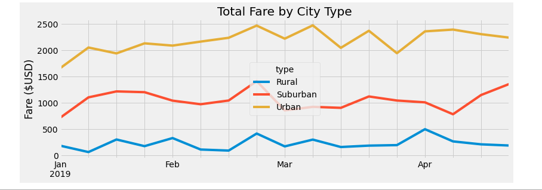

# PyBer_Analysis
## Overview of the analysis
The purpose of this project was to create visualizations of rideshare data for PyBer to help improve access to ride-sharing services and determine affordability for underserved neighborhoods. Datasets for the following catergories were created to analyze data for Urban, Suburban, and Rural areas.
  * Total Rides
  * Driver Count
  * Average Fare
  * Ride Count
  * Total Fares
  * Total Drivers

A new analysis was created to show the total weekly fares for each city by type from January 1, 2019 to April 29th, 2019. 

## Results
From these results we can see that Urban cities had the most rides, drivers and total fares. Urban fares were the lowest, but created the most amount of revenue at $39,854.38. Rural cities had the highest fare per ride, and average fare per driver. Although they had the highest average fare, they created the least amount of fares at $4,327.93. Based off of these results, we can conclude that Urban cities bring in the most amount of revenue, despite having the lowest fares. 

The second analysis that was completed for Jan 1, 2019 to April 29th, 2019 shows us that again, Urban cities had the highest total fares, whole Rural cities had the least. Week 4 of February, 2019 had the highest amount of fares in all cities. Towards the end of April, both Urban and Rural cities start to decline while Suburban fares start to incline. 

## Summary

Based on these results I would recommend the following:
 * Funnel more reveneue for items like ads, discounts, and app updates into Urban areas. Urban areas generate the bulk of the companies profits, to increase this trend, funnel money into Urban areas. Generating more income in the Urban areas will help make up for the disparities in profits from the rural and suburban areas. 
 * Have the drivers in Urban areas charge more per trip. This wil help increase profits and revenue but also increase fares per driver. Alternatively, charging less for fares in Rural areas might help inrease the number of total fares. 
 * Push coupons or deals to riders towards the end of the month to increase ridership, as ridership and fares statistically go down at the end of each month
